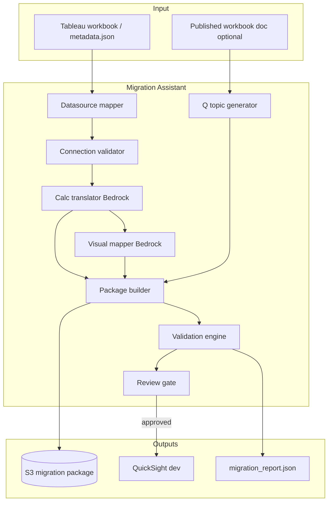
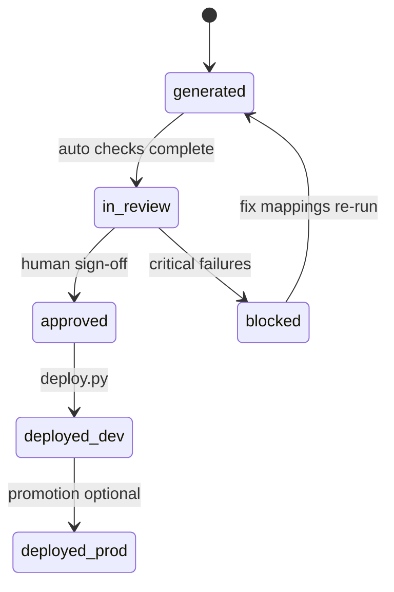

# Architecture

## High-level flow



## Shared ingest boundary

```text
tableau-workbook-knowledge-platform/
  parser/ → metadata.json

tableau-quicksight-migration-assistant/
  imports metadata.json (S3 path or API)
  does NOT duplicate long-term doc editorial workflow
```

Optional: publish `metadata.json` to shared S3 prefix  
`s3://{org}/workbooks/{id}/latest/metadata.json`.

## Migration package layout (S3)

```text
s3://{bucket}/migrations/{workbook_id}/{run_id}/
  source/
    metadata.json
    tableau_version.txt
  mappings/
    datasources.yaml
    datasets.yaml
    calculations.yaml      # tableau → QS with confidence
    visuals.yaml
    parameters.yaml
  generated/
    layout_mapping.md
    q_topics.yaml
    q_documentation.md
  deploy/
    deploy.py              # boto3 entrypoint
    config.env.example
    dry_run_plan.json
  validation/
    migration_report.json
    calc_parity_results.csv
  manifest.json            # statuses, approver, bedrock_model_id
```

## Generation stages (Step Functions-friendly)

| Stage | Input | Output | Failure mode |
|-------|-------|--------|--------------|
| 1 Map datasources | metadata.json | `datasources.yaml` | `BLOCKED` if unknown connection class |
| 2 Validate connections | yaml + secrets | pass/fail per source | `BLOCKED` on fail |
| 3 Translate calcs | metadata + rules | `calculations.yaml` | `WARN` on low confidence |
| 4 Map visuals | metadata | `visuals.yaml` + `layout_mapping.md` | `WARN` on unsupported chart |
| 5 Q assets | metadata + published doc | `q_topics.yaml` | `SKIP` if no doc |
| 6 Build deploy | all yaml | `deploy.py`, `dry_run_plan.json` | — |
| 7 Validate | package + sample data | `migration_report.json` | `FAIL` if critical checks |

## Deploy modes

| Mode | Behavior |
|------|----------|
| `dry-run` | Emit plan JSON only; no QuickSight mutations |
| `dev-deploy` | Apply to dev account/namespace after approval |
| `bundle-export` | Produce asset bundle for manual import (portfolio-friendly) |

## Human review gate



## QuickSight asset model (conceptual)

```text
Data source → Dataset → Analysis → Dashboard
                    ↘ Q Topic (column semantics)
```

Deploy script creates resources in dependency order; rolls back on failure (best-effort).

## Security

- QuickSight and warehouse credentials in Secrets Manager; never in generated yaml committed to git.
- Deploy role least privilege: `quicksight:*` scoped to dev namespace for MVP.
- Generated packages may contain **connection hostnames**—treat S3 prefix as internal.

## Portfolio MVP simplification

See [`MVP_SPEC.md`](MVP_SPEC.md): single sample workbook, dry-run + optional one dev dashboard, no Step Functions required.
